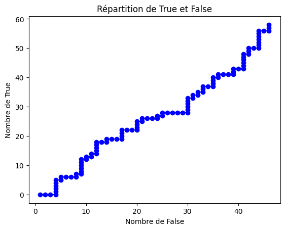
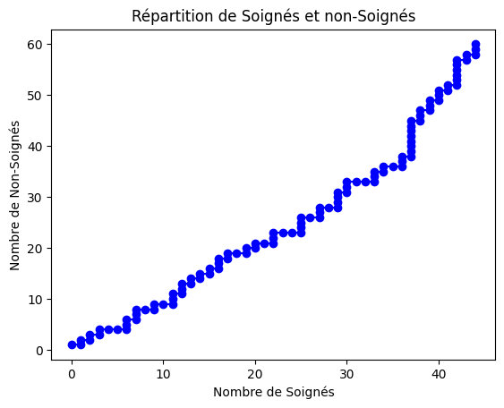
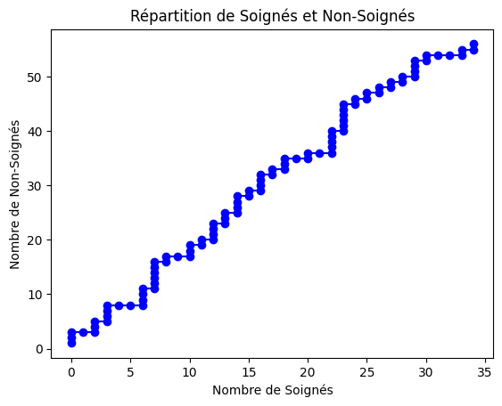

# Projet Médicament

## Présentation du projet :
Des soignants doivent soigner *le plus de personne possible* sur 100 jours avec 10 médicaments, mais ils ne savent pas quels sont les meilleures médicaments.

## Présentation des règles :
Des soignants ont accès à __10 médicaments__.
Ils peuvent attribuer 1 médicament par jour à un et un seul patient.

L'expérience dure 100 jours.

Le but est de maximiser les chances de guérisons des patients au *cours des 100 jours*, pas uniquement à la fin des 100 jours.

Un médicament n'a que deux états sur un patient : la réussite ou l'échec.

## Structure du projet :
Pour des raisons pratiques, le projet a été découpé en 3 grandes classes :

-   Le patient : il contient une méthode ``medicamentFonctionne(num_medicament)`` qui retourne True ou False en fonction de si le médicament à marché ou non.
-   Les soignants : Ils contiennent trois méthodes :
    -   La méthode des 20 jours, ou chaque médicament va être testé 2 fois, et à chaque fois on enlève le moins efficace.
    -   La méthode des 10 jours, ou chaque médicament ne sera testé qu'une seule fois.
    - La méthode des 10 jours avec beta, ou ici on utilise la loi beta pour calculer plus efficacement les meilleures medicaments, mais on teste toujours les médicaments une seule fois.
-   La classe médicament qui sert juste à donner un taux de guérison en fonction du numéro de médicament donné. Cette classe n'est utilisé que par le patient.

## Méthodes choisies :
3 grandes méthodes ont été choisies.

La première méthode a être choisie à été 
**La Méthode des 20 Jours**, première méthode à avoir été developpé.
Ici, le principe est de partir des 10 médicaments, et de les tester 2 fois chacun. 

20 jours plus tard, on refait pareil, mais en enlevant celui qui a été le moins efficace. Cette fois ci, cela nous prendra 18 jours. Puis on recommence, encore et encore.

Cette méthode prendrait 20 jours + 18 jours + 16 jours + 14 jours ...  c'est-à-dire ***110 jours***.
C'est le problème de cette méthode : les choix ne sont pas pris assez vites et trop de temps est donné à l'exploration. En plus, cette méthode prend un peu trop de temps et depasse sur le cota des 100 jours.

Regardons les statistiques :

`Nombre de personne Guéris : 64`

Ici, **64 personnes** sont guéris. Pourtant, le temps de réussite moyen des médicaments est de 43.3 %.
Cette méthode a donc permis d'augmenter de 20 points le nombre de personnes guéris.

Cependant cette méthode a ses limites : comme nous pouvons le voir, cette méthode devient très efficace à la fin de son cycle, pas au début.

Ainsi, il faut attendre très longtemps avant de véritablement guérir les gens.

En d'autre terme, *la phase d'exploration est trop grande par-rapport à la phase d'exploitation*.

Pour resoudre ce problème, la deuxième méthode propose est la **méthode des 10 jours**. Ici, le but est de réduire la phase d'exploration en divisant par deux le nombre de tests par médicament.
*Ainsi, nous passons de 110 jours d'exploration à 55*.
Le but ? Augmenter le nombre de jour d'exploitation pour guérir plus de patients.

Théoriquement, cela permettrait de trouver plus rapidement le meilleur medicament et donc de soigner plus tôt plus de patients.

Cependant, cette méthode fonctionne moins bien que la méthodes des 20 jours :

`Nombre de personne Guéris : 60`

Cela est surement du a un problème de programmation ou les mauvais éléments sont mal supprimés.

Mais il existe une meilleure méthode pour trouver le meilleur médicament :

La **méthode des 10 jours avec beta**.

Le but ? Utiliser la loi bêta pour deviner plus précisément les taux de guérison des différents médicaments.

Cette fameuse loi bêta augmentera nos chances de trouver un taux de guérison plus proche de la réalité.

Cependant, la répartition de l'exploration est la même que précédemment, elle présente donc ses limites :

`Nombre de personne Guéris : 67`

**Ici, nous guérisons environ 67 personnes**, c'est bien mieux qu'auparavant,
mais le système de la phase d'exploration est mal mis en place : Un test par fonction c'est trop peu pour savoir avec précision quel test enlever à chaque tour. 
C'est très probable qu'un médicament n'ait "pas de chance" et qu'il soit supprimé dans les premiers "tours", alors même que son taux de guérison est élevé.

**Pour réduire ca**, il faudrait augmenter le nombre de médicament supprimé par tour, tout en augmentant le nombre de test par médicament.

Proposition : Supprimer 3 médicaments par tour, mais en testant chaque médicament 3 fois, cela ferait (3 * 10 + 3 * 7 + 3 * 4) = 63 jours **d'exploration** pour 37 jours **d'exploitation**.

## Courbes beta

Chaque médicament possède une courbe beta, qui décrit quel est le taux de guérison le plus probable. Les courbes bêta des différents médicaments sont affichés juste en dessous.

Attention, dû au faible nombre de tests par médicament, le graphique ici représenté est sûrement faussé !

Nous pouvons ici remarquer que les médicaments les plus efficaces ( 8 et 2 ) sont les plus représentés, mais que le médicament 6, qui est le médicament le plus efficace, n'est pas représenté ! C'est tout simplement dû à la chance, les médicaments n'étant pas testés suffisamment, il est très commun que même les meilleurs médicaments sont exclus, à cause d'un manque de chance.

## Conclusion

Il existe différentes méthodes pour trouver le meilleur médicament, mais il ne faut pas confondre "meilleur médicament trouvé au bout de 100 jours" et "le plus de personne guéries en 100 jours".

Il est important d'avoir une phase d'exploration de taille conséquente, histoire de trouver le plus facilement possible le meilleur médicament, mais il est aussi important d'avoir une phase d'exploitation qui permet de guérir le plus de personnes.

De même, tester plusieurs fois les mêmes médicaments est important pour éviter les "manques de chances".

Ainsi, pour compenser la durée des tests, il est important de supprimer rapidement les plus mauvais médicaments.

Finalement, la loi bêta est très efficace pour calculer efficacement le taux de guérison.